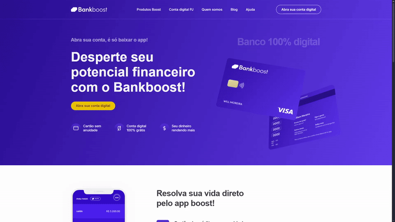

# 🚀 Bankboost: Landing Page de Banco Digital (Codeboost Project)

Este projeto marca um passo importante na minha jornada de desenvolvimento front-end: a codificação da landing page do **Bankboost**, um banco digital fictício, como parte do meu aprendizado no curso #Codeboost. O objetivo principal foi aprofundar minhas habilidades de **análise de estrutura de sites** e a **codificação robusta em HTML e CSS**, além de uma **introdução prática ao JavaScript**.

## ✨ Tecnologias Utilizadas

* **HTML5:** Estrutura semântica e acessível do conteúdo, a base sólida para o projeto.
* **CSS3:** Estilização completa, com foco em uma **responsividade fluida** para adaptar a interface a qualquer dispositivo.
* **JavaScript:** Pequenas interações para aprimorar a experiência do usuário e dar vida à interface.
* **Sass (SCSS):** Utilizado para organizar e otimizar o CSS, garantindo um código mais claro, modular e fácil de manter.

---

## 🎯 O Desafio da Codificação e Meu Processo

Mesmo com aulas bem estruturadas, o processo de codificar o design existente do Bankboost foi um desafio instigante. Cada linha de código foi pensada para traduzir o visual em uma solução funcional e eficiente. Meu olhar como UI Designer me guiou para garantir que cada pixel e interação estivessem no lugar certo, como um *headshot* certeiro em um FPS – precisão é tudo.

Para manter o código tão **claro e objetivo** quanto minhas entregas, utilizei **Sass**. Esse pré-processador foi fundamental para organizar o CSS de forma mais limpa e escalável, refletindo minha busca por evitar retrabalho e focar em entregas que respeitem o tempo do time.

---

## 💡 Destaques Técnicos e Aprendizados Valiosos

O maior destaque técnico do projeto é, sem dúvida, a **combinação de uma responsividade bem executada com microinterações que enriquecem a experiência do usuário**. Não é só sobre a tela se ajustar; é sobre ela *responder* e *encantar*.

Este projeto foi incrivelmente edificante. A lição mais valiosa que tiro é a clareza cristalina de que **organizar, limpar o código e focar na responsividade e em microinterações faz toda a diferença**. Essa experiência solidificou minha visão mais técnica na análise da estrutura do site antes mesmo de começar a codificar, transformando a forma como vejo e abordo a construção de interfaces. É como planejar uma estratégia em um jogo: a execução perfeita depende da visão prévia.

---

## 🌐 Acesse o Projeto Online

Você pode visualizar a landing page do Bankboost em funcionamento através do link abaixo:

[**Acesse Bankboost Online**](https://bankboost-knz.netlify.app)

---

## ⚙️ Como Rodar o Projeto Localmente

Quer ver como essa landing page funciona na prática? Siga estes passos rápidos:

1.  **Clone o repositório:**
    ```bash
    git clone [https://github.com/felipekenzoo/bankboost.git](https://github.com/felipekenzoo/bankboost.git)
    ```

2.  **Navegue até a pasta do projeto:**
    ```bash
    cd nome-do-seu-repositorio
    ```

3.  **Abra o arquivo `index.html` no seu navegador:**
    Simplesmente clique duas vezes no arquivo `index.html` ou arraste-o para a janela do seu navegador.

---

## 📸 Prévia do Projeto



---

## 🤝 Contribuições

Este projeto foi desenvolvido para fins de estudo e prática de front-end. Toda contribuição é bem-vinda, seja para otimizar o código ou sugerir novas funcionalidades!

---

## 🔗 Conecte-se Comigo

Curtiu a pegada do projeto? Quer trocar uma ideia sobre UI/UX, desenvolvimento front-end ou como unir estratégia e conhecimento para criar experiências incríveis? Me encontra no LinkedIn! Adoro conversar sobre como o design pode resolver, encantar e evoluir.

https://www.linkedin.com/in/felipe-kenzo-021371236/

---

## 📜 Licença

Este projeto está sob a licença MIT. Veja o arquivo [LICENSE](LICENSE) para mais detalhes.
